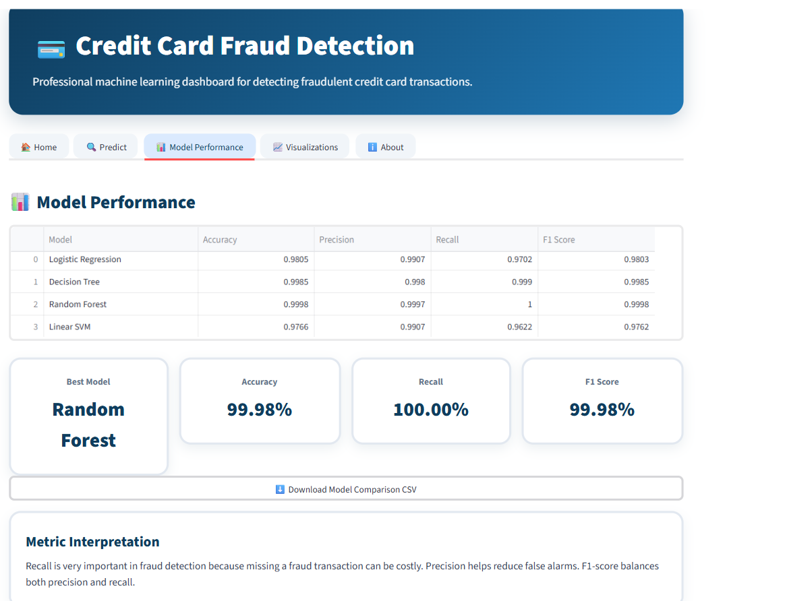
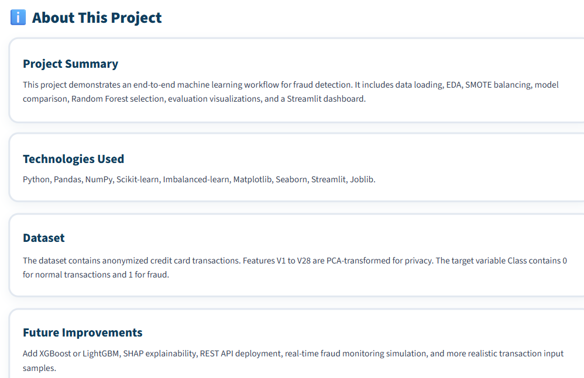

# 💳 Credit Card Fraud Detection using Machine Learning

A professional Machine Learning project that detects fraudulent credit card transactions using multiple classification algorithms. The project addresses the highly imbalanced nature of fraud detection using **SMOTE (Synthetic Minority Over-sampling Technique)** and provides an interactive **Streamlit Dashboard** for prediction and model visualization.

---

## 📌 Project Overview

Credit card fraud detection is one of the most important applications of Machine Learning in the banking and financial sector. Since fraudulent transactions are extremely rare compared to genuine ones, this project uses data balancing techniques and multiple machine learning models to accurately identify fraud.

The project includes:

- Exploratory Data Analysis (EDA)
- Data Balancing using SMOTE
- Feature Scaling
- Multiple Machine Learning Models
- Model Comparison
- Fraud Prediction
- Professional Streamlit Dashboard
- Model Evaluation using various metrics

---

# 🚀 Features

- 📊 Exploratory Data Analysis (EDA)
- ⚖️ Class Imbalance Handling using SMOTE
- 🤖 Multiple Machine Learning Models
- 📈 Model Comparison
- 🎯 Fraud Prediction
- 📉 Confusion Matrix
- 📊 ROC Curve
- 📈 Precision-Recall Curve
- 🌳 Feature Importance
- 💻 Interactive Streamlit Dashboard
- 📁 Well Structured Project
- ☁️ Streamlit Deployment Ready

---

# 📂 Dataset

**Dataset Name:**

Credit Card Fraud Detection Dataset

**Source:**

Kaggle

Dataset contains:

- 284,807 Transactions
- 492 Fraud Transactions
- 30 Features
- Target Variable:
  - 0 → Normal Transaction
  - 1 → Fraud Transaction

Due to confidentiality, feature names V1–V28 are PCA-transformed.

---

# 📊 Exploratory Data Analysis

Performed:

- Dataset Information
- Missing Value Check
- Class Distribution
- Amount Distribution
- Fraud vs Normal Comparison
- Correlation Analysis

---

# ⚙️ Data Preprocessing

The following preprocessing techniques were applied:

- Missing Value Verification
- Feature Scaling
- Train-Test Split
- SMOTE Oversampling
- Dataset Balancing

---

# 🤖 Machine Learning Models

The following models were trained and evaluated:

- Logistic Regression
- Decision Tree
- Random Forest ⭐ (Best Model)
- Linear SVM

Model selection was based on **F1 Score**.

---

# 📈 Model Evaluation

Evaluation Metrics:

- Accuracy
- Precision
- Recall
- F1 Score
- ROC Curve
- Precision-Recall Curve
- Confusion Matrix

---

# 📊 Visualizations

The project includes:

- Class Distribution
- Amount Distribution
- Confusion Matrix
- ROC Curve
- Precision-Recall Curve
- Feature Importance

---

# 💻 Streamlit Dashboard

The dashboard contains:

### 🏠 Home

- Project Overview
- KPI Cards
- Workflow
- Dashboard Preview

### 🔍 Prediction

- Transaction Prediction
- Fraud Probability
- Prediction Result

### 📊 Model Performance

- Model Comparison
- Best Model
- Download Report

### 📈 Visualizations

- Dataset Analysis
- Model Evaluation
- Feature Importance

### ℹ️ About

- Technologies Used
- Dataset Information
- Future Improvements

---

# 📁 Project Structure

```
Credit-Card-Fraud-Detection
│
├── app/
│   └── app.py
│
├── data/
│   ├── raw/
│   └── processed/
│
├── models/
│   ├── best_fraud_model.pkl
│   └── scaler.pkl
│
├── outputs/
│   ├── figures/
│   └── reports/
│
├── src/
│   ├── load_data.py
│   ├── eda.py
│   ├── balance_data.py
│   ├── train_ml.py
│   ├── predict.py
│   ├── confusion_matrix_plot.py
│   ├── roc_curve_plot.py
│   ├── precision_recall_curve.py
│   └── feature_importance.py
│
├── images/
│
├── requirements.txt
├── README.md
└── .gitignore
```

---

# 📸 Screenshots

## 🏠 Home Dashboard


---

## 🔍 Prediction Page


---

## 📊 Model Performance



---

## 📈 Visualizations


---

## ℹ️ About



---

# 🛠 Technologies Used

- Python
- Pandas
- NumPy
- Scikit-learn
- Imbalanced-learn (SMOTE)
- Matplotlib
- Seaborn
- Joblib
- Streamlit

---

# ⚙️ Installation

Clone the repository:

```bash
git clone https://github.com/vigneshgonda/Credit-Card-Fraud-Detection.git
```

Go to the project folder:

```bash
cd Credit-Card-Fraud-Detection
```

Install dependencies:

```bash
pip install -r requirements.txt
```

---

# ▶️ Run the Project

Train the models:

```bash
python src/train_ml.py
```

Run prediction:

```bash
python src/predict.py
```

Launch the dashboard:

```bash
streamlit run app/app.py
```

---

# 📌 Future Improvements

- Deep Learning Models (ANN)
- XGBoost
- LightGBM
- Explainable AI (SHAP/LIME)
- Real-time Fraud Detection
- REST API Deployment
- Docker Support

---

# 👨‍💻 Author

**Vignesh Gonda**

## 🚀 Live Demo

🎯 **Try the application here**

### 🌐 https://credit-card-fraud-detection-6tfcy7s6uxbcrrztprfwhn.streamlit.app/